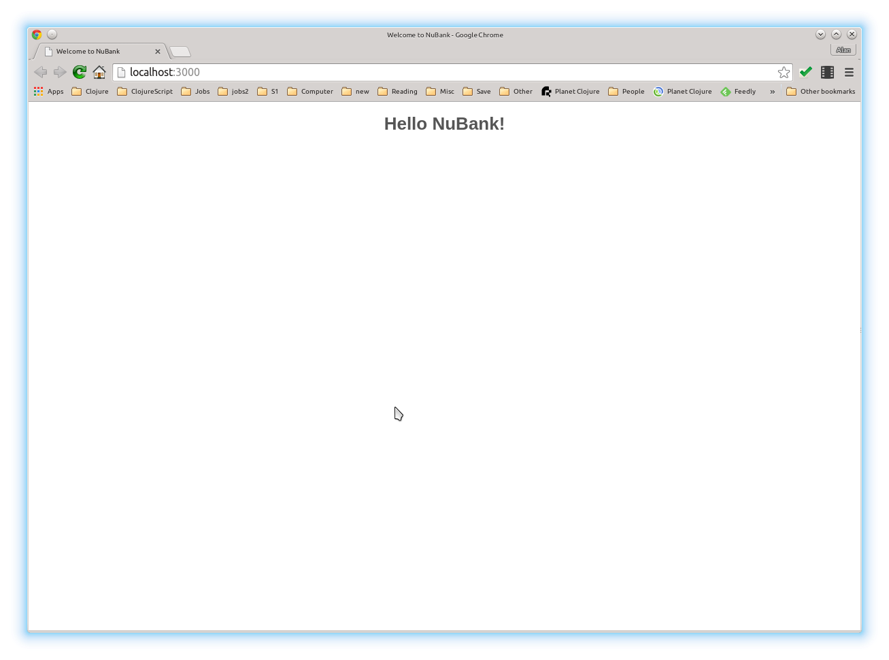

= NuBank Programming Challenge

This repo contains Clojure code for the NuBank Programming Challenge.  It is a basic
Ring/Compojure app which includes a number of unit tests and a simple main program.

== Prerequisites

You will need java 1.7+ and Leiningen 2 installed. The code was developed & tested on
Linux (Ubuntu 14.04) with these versions:
----
> lein --version
Leiningen 2.5.1 on Java 1.8.0_25 Java HotSpot(TM) 64-Bit Server VM
----

== Testing

Once you clone the repository, make sure you can run lein and execute the unit tests.  You
should see something like the following:
----
> lein deps
...
  <many jar's are downloaded>
...
> lein test
Initializing system state...

lein test tst.demo.array

 a34:
      00      01      02      03
      10      11      12      13
      20      21      22      23

lein test tst.demo.darr

darr-test

a34 #1
     0.0     0.0     0.0     0.0
     0.0     0.0     0.0     0.0
     0.0     0.0     0.0     0.0

a34 #2
    42.0    42.0    42.0    42.0
    42.0    42.0    42.0    42.0
    42.0    42.0    42.0    42.0

a34 #3
     0.0     1.0     2.0     3.0
    10.0    11.0    12.0    13.0
    20.0    21.0    22.0    23.0

lein test tst.demo.graph
load-graph:  lines read: 1   edges saved: 1
load-graph:  lines read: 1   edges saved: 1
load-graph:  lines read: 2   edges saved: 2
load-graph:  lines read: 5   edges saved: 5
load-graph:  lines read: 2   edges saved: 2
load-graph:  lines read: 7   edges saved: 7
load-graph:  lines read: 2   edges saved: 2
load-graph:  lines read: 2   edges saved: 2
load-graph:  lines read: 7   edges saved: 7
load-graph:  lines read: 7   edges saved: 7

lein test tst.demo.handler
received: (add-edge 3 4 )
received: (add-edge -1 4 )
received: (add-edge 1 999 )

Ran 10 tests containing 87 assertions.
0 failures, 0 errors.
----

The last line "0 failures, 0 errors" is the important part.  If something is wrong 
with your config please shoot me a quick email and we'll resolve it.

== Running

To start a web server for the application, execute the following in a spare window
(the "server window"):

    lein ring server

A new browser tab should pop up looking like this:

I've included some test data with a 6-node graph in addition to the full test data
supplied by NuBank as part of the challenge.  Let's start off with the test data first.

In a spare window (the "command window") line type:

----
> go-tst.bash 
----

In the server window you will see that seven edges connecting 6 nodes are added.  At this
point in your browser, go to the URL

----
localhost:3000:/graph
----

which should take you to a page like:
  

This shows a series of map entries describing the graph, where the key (first item) is
the node index (zero-based) and the value (second item) is a hash-set of the other nodes
to which the current node is connected. We can view the closeness measure for all nodes by
visiting the URL
----
localhost:3000:/closeness
----
which displays:
  

We can add a new edge using a URLs like:
----
localhost:3000:/add-edge/0/99
localhost:3000:/add-edge/3/99
----
Note that the node id's are just strings and need not be consecutive numbers.  The string
id is converted to an internal zero-based index (visible at the /graph URI), and we could
have even used an id like "***new-node***" if we had wanted instead of "99".  After
visiting both of the above URLs, return to the /graph URI to see:
  

